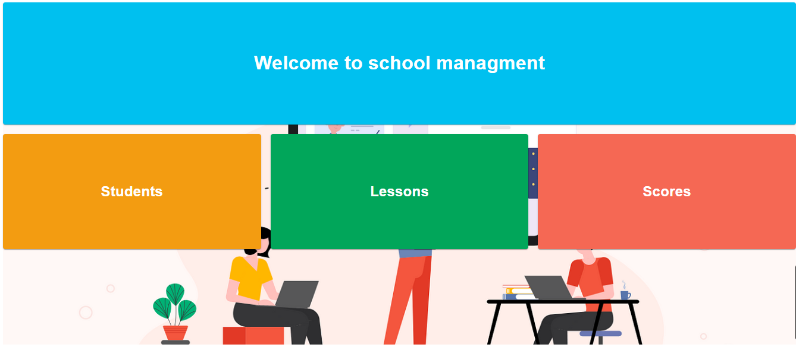
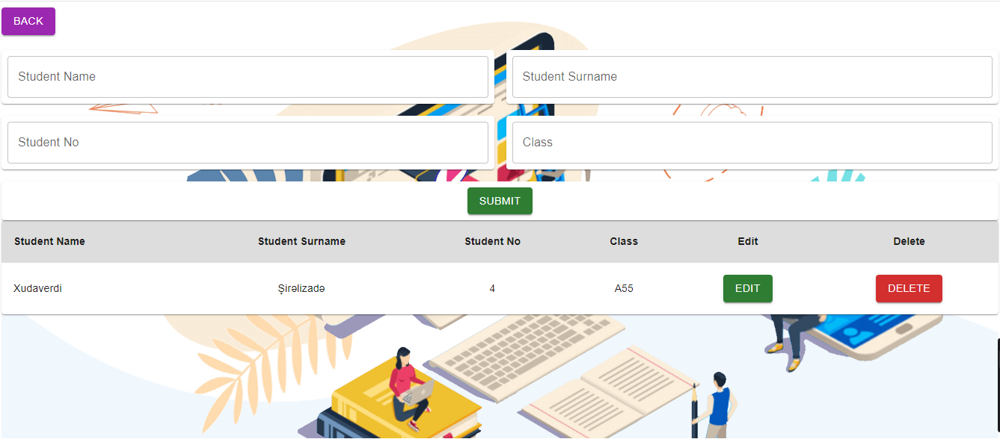
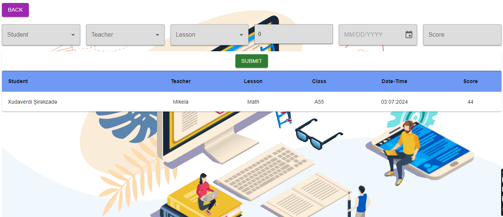

git clone link : https://github.com/Khudaverdi27/Student-managment.git

demo link: https://student-managmen.vercel.app/

School management system

1. The user can add a new student
2. the user can add a teacher and lesson
3. the user can see all the information of the added student and teacher in the final table.
4. The information of the student and the teacher can be corrected or deleted

Note:The connection between the student table and the teacher table is established through the class number

Examples from screen

Home screen

  

Student page

  

Result page

  

